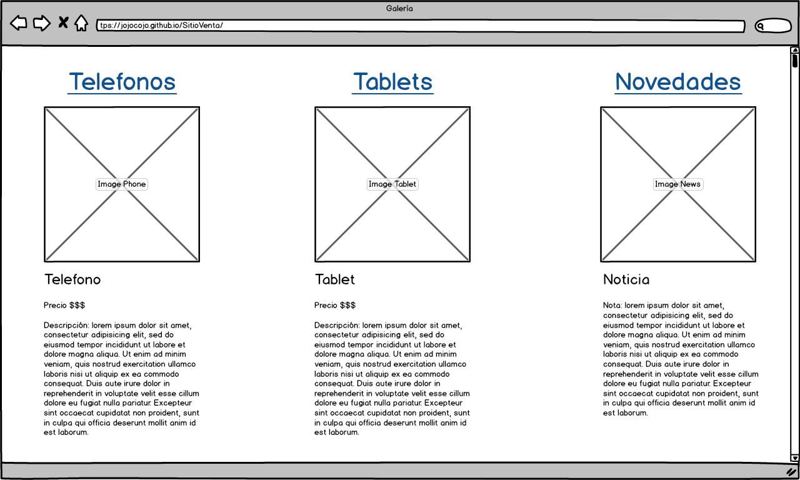
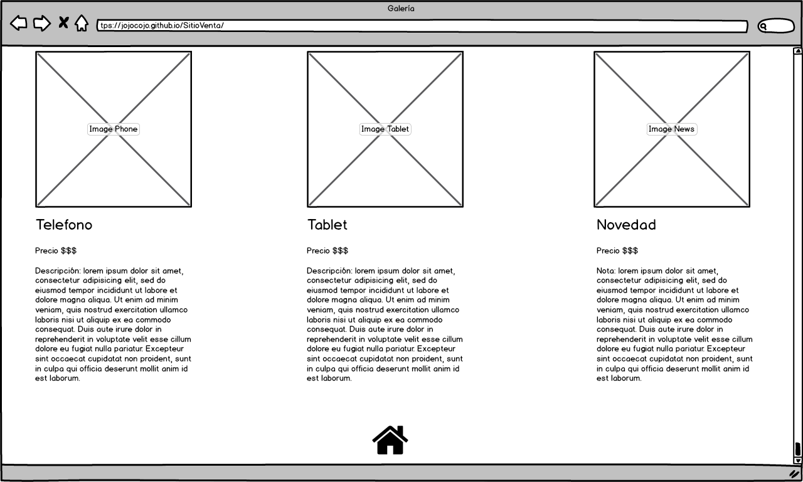
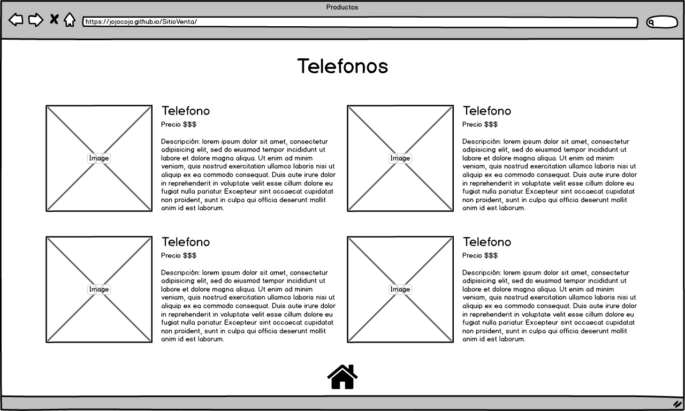
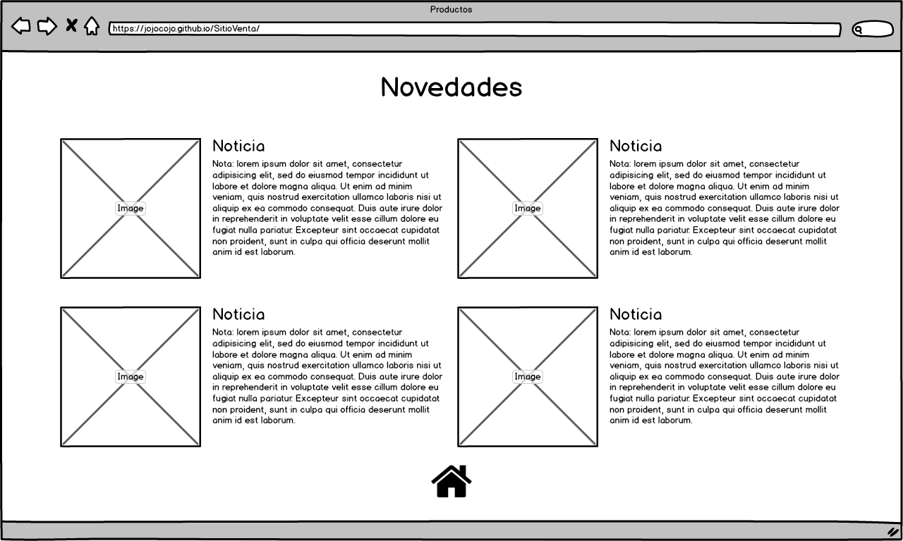
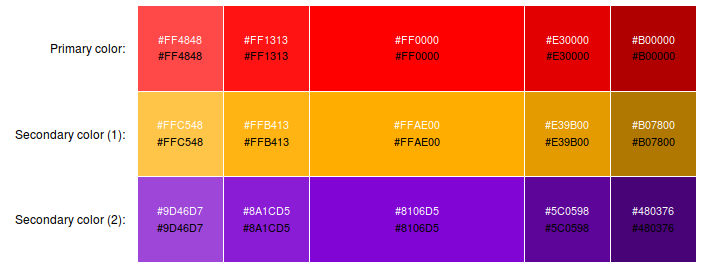

# SitioVenta
Sitio web en el cual se venden celulares y tabletas, asi como productos tecnologicos de ultimo moda.

## Site Map

  

El sitio contará con:
  * Index: O página principal/bienvenida.
  * Galería de Productos General: Se mostrarán todo los productos en general con los que cuenta el sitio.
  * Telefonos: Página donde se muestran sólo los Telefonos con los que cuenta el sitio.
  * Tablets: Página donde se muestran sólo las Tablets disponibles en el sitio.
  * Novedades: Página donde se muestran las noticias/gadgets más recientes.

## Wireframing

### Index

La pantalla de inicio:

  

En la cuál podemos observar que nos da la bienvenida, un link donde podemos ir directamente a la galería de productos y un video introductorio de la tienda en linea.

  

En la siguiente sección de la página principal podemos ver Testimonios de las personas que han comprado en nuesto sitio.

  

Y como último una sección de la página principal encontramos un área para poder mandar quejas y/ sugerencias en donde el usuario ingreará su correo electrónico, escojerá si es una "**queja**" o una "**sugerencia**", rellenar el mensaje dependiendo a su experiencia con la plataforma y por último el botón de enviar.

### Galería

Para la galería empezamos de la siguiente manera:

  

Donde se muestran los productos principales en venta de la página que son los Telefonos, Tablets y un apartado para las Novedades.

  

Y cuando se terminan de ver los productos disponibles, se muestra un icono de "**HOME**" que nos regresa a la página principal.

### Productos

Por último se hicieron los Mockups de los productos individuales donde se muestran según sean Telefonos, Tablets o en sus caso las Novedades más recientes y cuando se terminan de ver los productos disponibles según su tipo, se muestra un icono de "**HOME**" que nos regresa a la página principal.

#### Telefonos

  

#### Tablets

  

#### Novedades

  

## Diseño

  Se implemetará el siguiente diseño:

  * BODY:
    * Fuente: Droid Sans.

  * TITULOS:
    * Fuente: Tangerine.

  Usando de preferencia los colores:

  

    
  

  <table>
  	<tr>
  		<th>Primary color:</th>
  		<td style="background-color: #FF4848;">
  			
#FF4848

  		</td>
  		<td style="background-color: #FF1313">
  			
#FF1313

  		</td>
  		<td style="background-color: #FF0000">
  			
#FF0000

  		</td>
  		<td style="background-color:#E30000 ">
  			
#E30000

  		</td>
  		<td style="background-color:#B00000 ">
  			
#B00000

  		</td>
  	</tr>
  	<tr>
  		<th>Secondary color (1):</th>
  		<td style="background-color:#FFC548 ">
  			
#FFC548

  		</td>
  		<td style="background-color:#FFB413 ">
  			
#FFB413

  		</td>
  		<td style="background-color:#FFAE00 ">
  			
#FFAE00

  		</td>
  		<td style="background-color:#E39B00 ">
  			
#E39B00

  		</td>
  		<td style="background-color:#B07800 ">
  			
#B07800

  		</td>
  	</tr>
  	<tr>
  		<th>Secondary color (2):</th>
  		<td style="background-color:#9D46D7 ">
  			
#9D46D7

  		</td>
  		<td style="background-color:#8A1CD5 ">
  			
#8A1CD5

  		</td>
  		<td style="background-color:#8106D5 ">
  			
#8106D5

  		</td>
  		<td style="background-color:#5C0598 ">
  			
#5C0598

  		</td>
  		<td style="background-color:#480376 ">
  			
#480376

  		</td>
  	</tr>
  </table>
