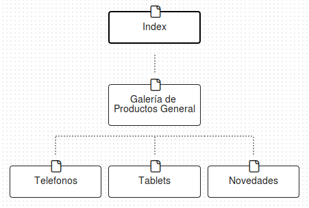
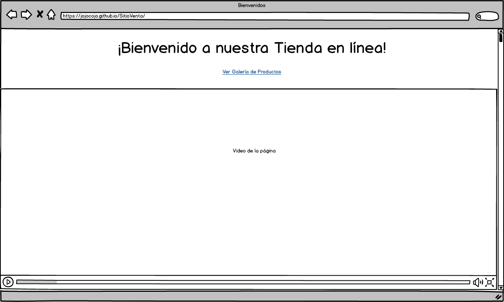
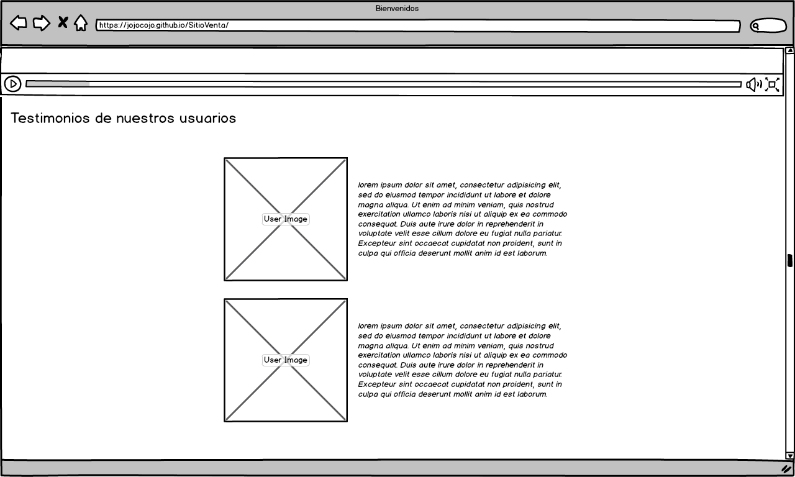
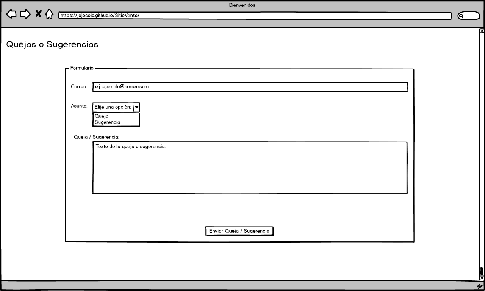

# SitioVenta
Sitio web en el cual se venden celulares y tabletas, asi como productos tecnologicos de ultimo moda.

## Site Map

  

El sitio contará con:
  * Index: O página principal/bienvenida.
  * Galería de Productos General: Se mostrarán todo los productos en general con los que cuenta el sitio.
  * Telefonos: Página donde se muestran sólo los Telefonos con los que cuenta el sitio.
  * Tablets: Página donde se muestran sólo las Tablets disponibles en el sitio.

## Wireframing

La pantalla de inicio:

  

En la cuál podemos observar que nos da la bienvenida, un link donde podemos ir directamente a la galería de productos y un video introductorio de la tienda en linea.

  

En la siguiente sección de la página principal podemos ver Testimonios de las personas que han comprado en nuesto sitio.

  

Y como último una sección de la página principal encontramos un área para poder mandar quejas y/ sugerencias en donde el usuario ingreará su correo electronico, escojera si es una "**queja**" o una "**sugerencia**", rellenar el mensaje dependiendo a su experiencia con la plataforma y por último el botón de enviar.
